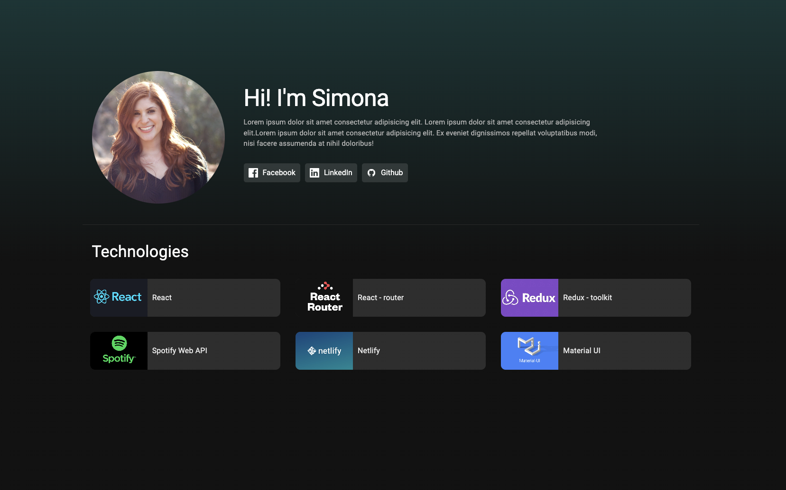
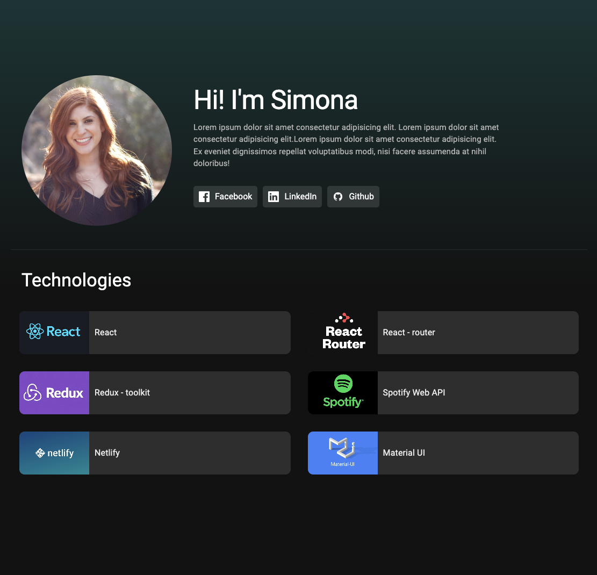
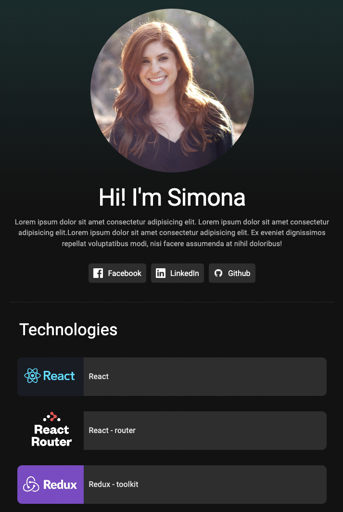

# Spotify Uppgift

## Uppgift

Vi ska göra en customize home page, där vi presenterar oss själva och beskriver vilka teknologier vi använt
för att bygga vårt spotify applikation. Det finns en design som vi utgår från och den används enbart som riktlinje,
dvs vi har fria händer att "tweeka" vår design utefter våra preferenser.

### Design

Vi använder oss utav Material UI som i hela vår applikation. Designen som ska göras ska vara responsive.
För att uppnå en responsive design använder vi oss av bland annat, flex och grid. I MUI så finns brytpunkterna

-   xs : 0px
-   sm : 600px
-   md : 900px
-   lg : 1200px

För att kunna skriva inline css i våra MUI componentet använder vi oss utav attributet sx={{ **VÅR STYLE** }}.
för att använda oss utav brytpunkterna inne i våran inline css kan vi använda oss av objekt, exempel visas nedan.


##### Exempel 
*Visar vårt element vid 900px uppåt*
```jsx
<Box sx={{ display: { xs: 'none', md: 'block' } }}>
	
</Box>
```


### Funktionalitet

Utöver den responsive designen ska vi även använda oss av en funktion samt ett state. Syftet med denna funktionlitet
är att kunna manipulera vår background-color beroende på vilket teknologi "kort" vi har musenpekaren över.
I react har vi tillgång till event vilken vi kan specifiera i vårt HTML

##### Exempel 
*Console.log vårt event vid MouseEnter och MouseLeave, _reactName beskriver eventet vilket kan vara användbart i if sats*

```jsx
<Box onMouseEnter={(event) => console.log(event)} onMouseLeave={(event) => console.log(event)}>
	
</Box>
```


### Desktop design



### Tablet design



### Mobile design

