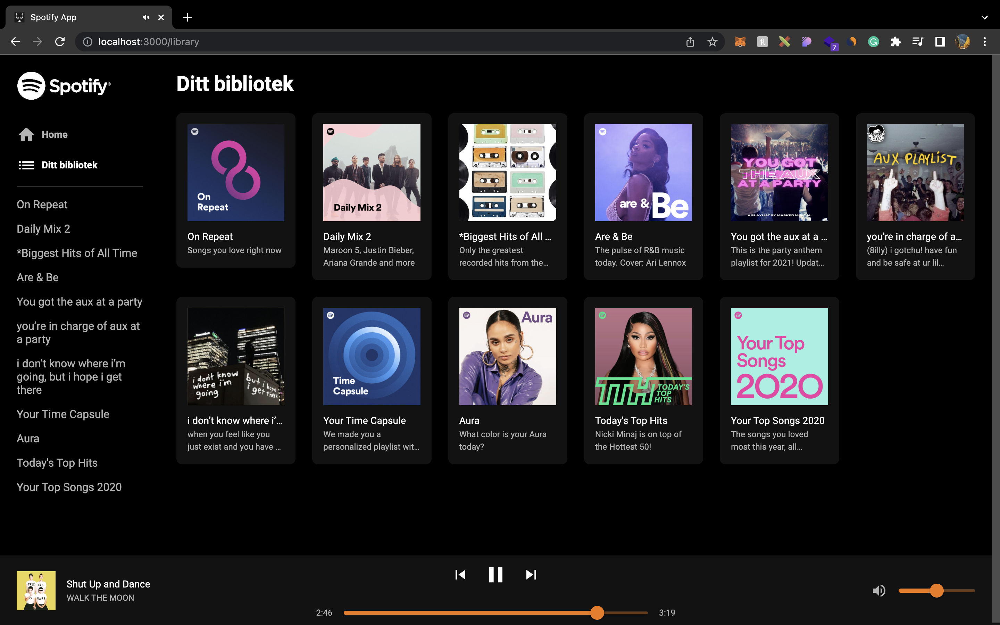
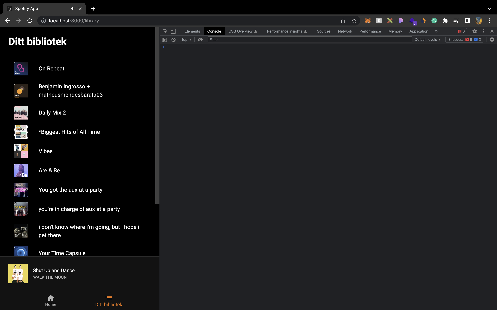

# Library cards uppgift

Denna uppgift kommer fokusera mer på att använda Material UI för att få en snygg ui än att använda messa komplicerad logik.

## Din uppgift

Denna uppgift ska du göra när du är klar med [F8](https://github.com/MMR-Solutions-AB/TA-Spotify-Clone/tree/F8) branchen. Uppgiften går ut på att skapa en list med kort för alla användarens spellistor i **pages/Library** filen. Du hittar en bild på hur det ska se ut nedan

### Steg att ta

-   I sidomenyn till vänster under **Home** taben ska du lägga till en ny tab för **Ditt bibliotek** som länkar till **/library**
-   När en användare kommer till **/library** på en stor skärm (**sm** i Material UI breakpoints vilket motsvarar 600px eller större) ska användare se kort på alla spellistor som finns. Dessa spellistor ska du redan ha hämtat via redux och borde redan finnas i **Library** komponenten som du ska ha gjort på [F8](https://github.com/MMR-Solutions-AB/TA-Spotify-Clone/tree/F8) branchen.
-   Så det enda du behöver göra är att skapa själva korten som sin egna komponent vilket du kan göra i en ny **components/PlaylistCard** fil.
-   På en liten skärm (600px eller mindre) ska användaren se en lista utav **components/PlaylistItem** komponenter, alltså inget nytt här utan allt du behöver göra nu är att gömma listan av kort och visa listan

### Tips

-   För att få själva bilden på spellistan att vara en perfekt kvadrat hela tiden kan du använda **aspect-ratio** propertyn från CSS (mer infor om den [här](https://developer.mozilla.org/en-US/docs/Web/CSS/aspect-ratio)), här är ett exempel

```jsx
<Box sx={{ width: '100%', 'aspect-ratio': '1/1' }}>
	
</Box>
```

-   För att skapa layouten kan du använda grid från Material UI, du hittar deras docs [här](https://mui.com/material-ui/react-grid/)

### Desktop design



### Mobile design


