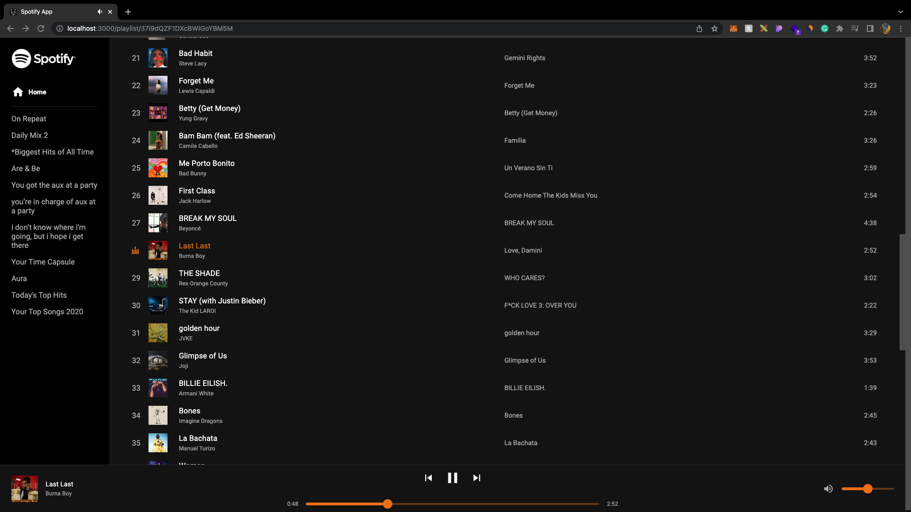

# Playlist playing state

Denna uppgift kommer fokusera på att ändra vår Redux logik för att hålla koll på vilken låt som spelas och sen visa det till användaren.

## Din uppgift

Denna uppgift ska du göra när du är klar med [F6](https://github.com/MMR-Solutions-AB/TA-Spotify-Clone/tree/F6) branchen. Hur din hemsida funkar nu är att när man navigera in på en spellista så ser en man en lista på alla låtar i den spellistan som även är numrerade med vilken position låten ligger i spellistan, men en sak som inte finns med är ifall en av dessa låtar i spellistan spelas så syns det inte för användaren, vi ska nu lösa det genom att ändra färgen på låtens namn samt att ändra siffran som står bredvid till 5 stycken små staplar som går upp och ner. Du hittar en bild på hur det ska se ut längst ner i denna fil.

### Steg att ta

-   I **store/playerSlice** filen ska du lägga till en ny reducer som ska kunna ändra redux state på vilken låt som spelas, state på vilken låt som spelas ska också ha ett id som du kommer kunna använda senare
-   I **components/Player** filen ska du nå använda din nya reducer för att uppdatera låten som spelas med hjälp utav **useDispatch** från Redux
-   Du borde nu kunna få tillgång till vilken låt som spelas i **components/SongTable** komponent via **useSelector** hooken, nu kan du lägga till en ny prop till **components/SongRow** komponent som heter **isPlaying** och ge den **true** eller **false** beroende på om låten spelas
-   Nu ska du använda din nya **isPlaying** prop i **components/SongRow** komponent för att conditionally rendera numret numret eller de små "staplarna" till vänster av raden samt att ändra text-färgen på låtens namn

### Tips

-   När det kommer till själva animationen av "staplarna" som går upp och ner kan du använda **animation-delay** (mer info om animation-delay hittar ni [här](https://developer.mozilla.org/en-US/docs/Web/CSS/animation-delay)) och **CSS variabler** för att få alla de att vara osynkade, [här](https://youtu.be/Qhaz36TZG5Y?t=406) kan du se hur man skulle göra något sånt, ta det som sägs i videon och anpassa det så att det passar just det som du försöker göra.

### Solution design

