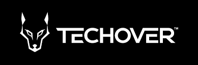

# Spotify Clone

## Vad görs denna branch

-   Skapar [MobileNav](./src/components/MobileNav/MobileNav.jsx) komponenten
-   Skapar [PlayerOverlay](./src/components/PlayerOverlay/PlayerOverlay.jsx) komponenten
-   Skapar [PlayerVolume](./src/components/PlayerVolume/PlayerVolume.jsx) komponenten

## Övergripande

En responsive Spotify clone skapad med relevanta verktyg (se nedan). Applikationen består av ca 20 komponenter där vi använder oss utav Spotifys Web Api samt Spotifys SDK för att skapa en Spotify lik upplevelse. I applikationen finns möjlighet att se sina album, spellistor, spela låtar, pausa låtar, spola och justera volym.

### Upplägg

Spotify projektet kommer byggas under 5 dagar med 2 föreläsningar per dag. Varje föreläsning kommer fokusera på att bygga ut vissa delar i taget. För varje föreläsning finns en motsvarande **Branch** och **Pull request** som har namn som exempelvis **F1** för **föreläsning 1**, du hittar alla **Pull requests** [här](https://github.com/MMR-Solutions-AB/TA-Spotify-Clone/pulls). Vill du se vad som gjordes en specifik föreläsning är det bara att tryck på respektive **Pull request** för den föreläsningen. Det finns även ett par **Pull requests** och **Branches** som inte har namn som exempelvis **F1**, dessa är extra uppgifter som du ska göra utöver föreläsningar. Du hittar all info om vad som ska göras i **README.md** filen i den branchen.

### Starta Applikationen

För att starta en projektet, är det ett par grejer du måste göra.

1. Först steget är att skapa ett nytt Spotify projekt på [spotify dashboarden](https://developer.spotify.com/dashboard/applications). När du navigerar till den länken kommer de först be dig logga in med ditt personliga Spotify konto, när det är gjort borde du navigeras till **/dashboard/applications** (om inte tryck [här](https://developer.spotify.com/dashboard/applications)). Nu ska du se en grön knapp med texten **CREATE AN APP** till höger, tryck på den knappen. Nu måste du ge ditt projekt ett namn, exempelvis **Spotify clone**, en beskrivning, exempelvis **En spotify klon byggd i React**, sen checka för **Terms of service** boxen och tryck på den gröna knappen med texten **CREATE**.
2. När du har skapat ett nytt Spotify projekt kommer spotify gå in i det projektet, annars kommer du alltid kunna se den i din [dashboard](https://developer.spotify.com/dashboard/applications). Nu kommer du kunna se en **Client ID** till vänster och exakt under ska det finnas grön text med texten **SHOW CLIENT SECRET**, när du trycker på den texten kommer den visa **Client secret** för ditt projekt.
3. I VS code, byt namn på **.env.example** filen till **.env** och kopiera **Client ID** och **Client secret** i respektive befintliga env variabler i **.env** filen
4. När det är gjort har vi bara ett steg kvar. I ditt projekt på Spotify Dashboarden där du precis kopierade **Client ID** och **Client secret**, finns det en grön knapp med texten **Edit settings** till höger som du ska trycka på. Nu ser du dina inställningar för projektet och där finns det ett fält för **Redirect URIs**, skriv in **http://localhost:3000** och sedan tryck på den gröna knappen exakt till höger med texten **ADD** och sist tryck den gröna knappen längst ner bland inställningarna med texten **SAVE**
5. Nu är allt förarbete klart och du kan använda din hemsida. I terminalen kan du nu köra **npm run dev** och borde se att projektet funkar

### Verktyg

Applikationen använder följande Node module paket

-   Material UI
-   React Router V6
-   React-redux / redux-toolkit
-   Spotify-web-api-node
-   Spotify SDK

### Dokumentation:

-   [Spotify web playback sdk](https://developer.spotify.com/documentation/web-playback-sdk/reference/)
-   [Spotify web api](https://developer.spotify.com/documentation/web-api/reference/#/)
-   [Material UI](https://mui.com/material-ui/getting-started/overview/)
-   [React](https://beta.reactjs.org/)
-   [Redux](https://redux-toolkit.js.org/introduction/getting-started)
-   [React router](https://reactrouter.com/en/main)

OBS! På grund utav begränsningar från Spotify sida kommer inte andra människor använda din hemsida när den är deployad, om du inte har whitelistat deras emails i dashboarden vilket du kan göra under **Users and access** tabben.
